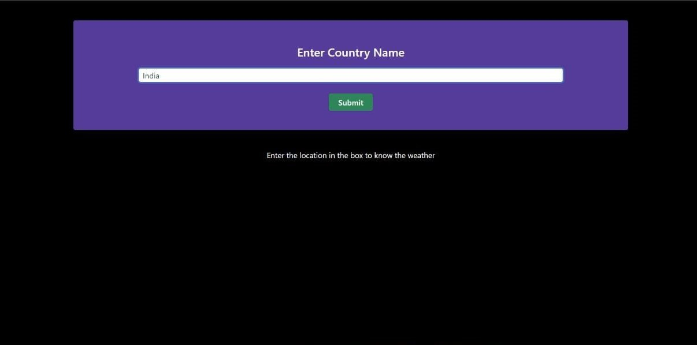
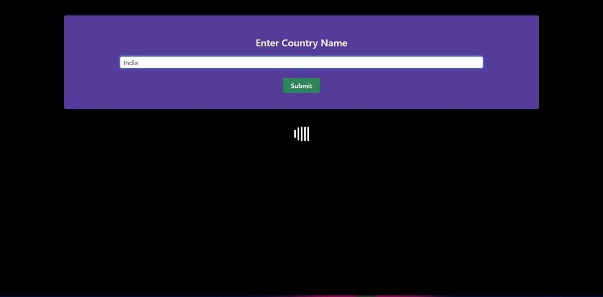
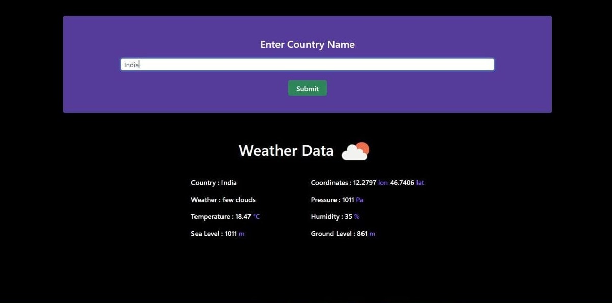

<h1>Weather Application</h1>  

> ### _Simple weather application built using ReactJs, ExpressJs and OpenWeatherMap API_

## [View Demo](https://weather-app-28.netlify.app)

<!-- # [Weather Application](https://weather-app-28.netlify.app/) -->

 

## Tech Stack and Dependencies

| Name                                                     | Description                                           |
| -------------------------------------------------------- | ----------------------------------------------------- |
| **[ReactJs](https://reactjs.org)**                       | Front End                                             |
| **[ExpressJs](https://expressjs.com)**                   | Back End                                              |
| **[Tailwind CSS](https://tailwindcss.com/)**             | CSS Framework                                         |
| **[OpenWeatherMap Api](https://openweathermap.org/api)** | Weather API                                           |
| **[Axios](https://axios-http.com/)**                     | Promise-based HTTP Client for node.js and the browser |

 

## Demo

<!-- 

 -->

<!--  rb!?&S(pd8Wd53Y
 
  -->

 

> ### _As the server is hosted on a free Heroku account, the server enters ‘sleep mode’ when not in use. If you notice a delay, please allow a few seconds for the servers to wake up._

 

## Find the app [here](https://weather-app-28.netlify.app/).
